

# PA4 Submission: TaskFlow Pipeline

## Student Information

| Field | Value |
|---|---|
| Name | Muhammad Saad Nazeer |
| Roll Number | 24060013 |
| GitHub Repository URL | https://github.com/MSNazeer/CS487-PA4 |
| Resource Group | `rg-sp26-24060013` |
| Assigned Region | `ukwest` |

---

## Task 1: App Service Web App (15 points)

### Evidence 1.1: Forked Repository
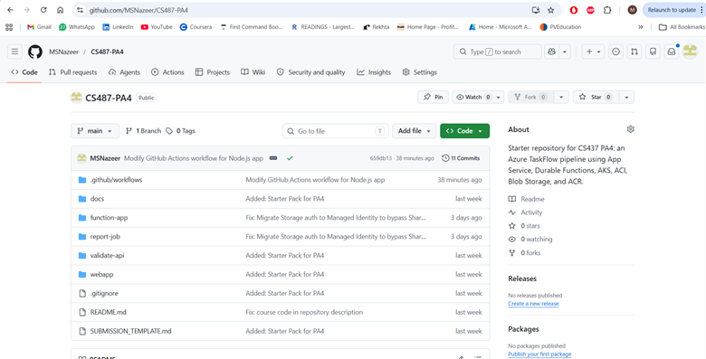
Description: This shows my forked GitHub repository containing the complete project structure and the starter code for PA4.

### Evidence 1.2: App Service Overview
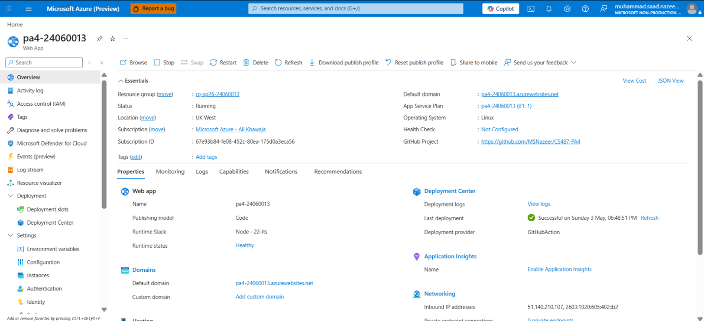
Description: The Web App `web-pa4-24060013` is running in the `ukwest` region within the `rg-sp26-24060013` resource group.

### Evidence 1.3: Deployment Center / GitHub Actions
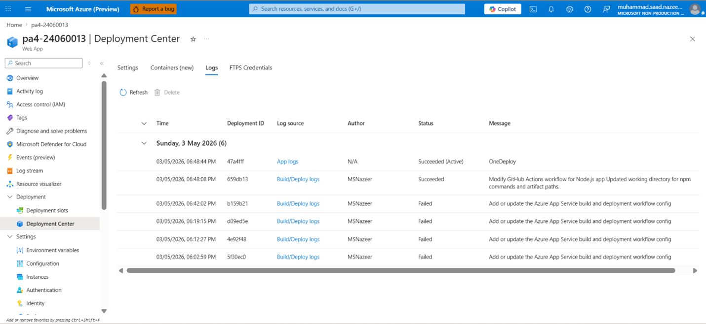
Description: This screenshot confirms the successful connection between the Azure Web App and my GitHub repository via GitHub Actions for automated deployment.

### Evidence 1.4: Live Web UI
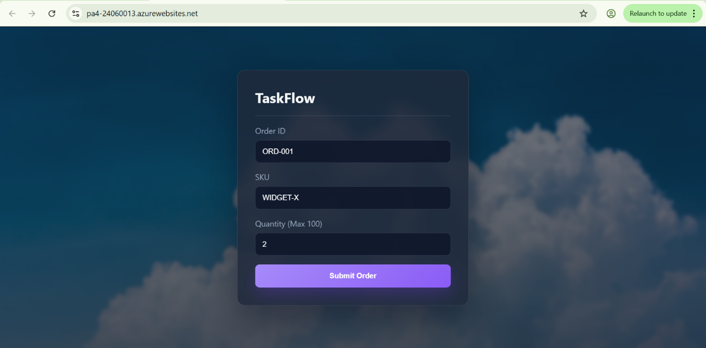
Description: The live TaskFlow UI is successfully served by the App Service and is accessible at the public URL.

---

## Task 2: Azure Container Registry (15 points)

### Evidence 2.1: ACR Overview
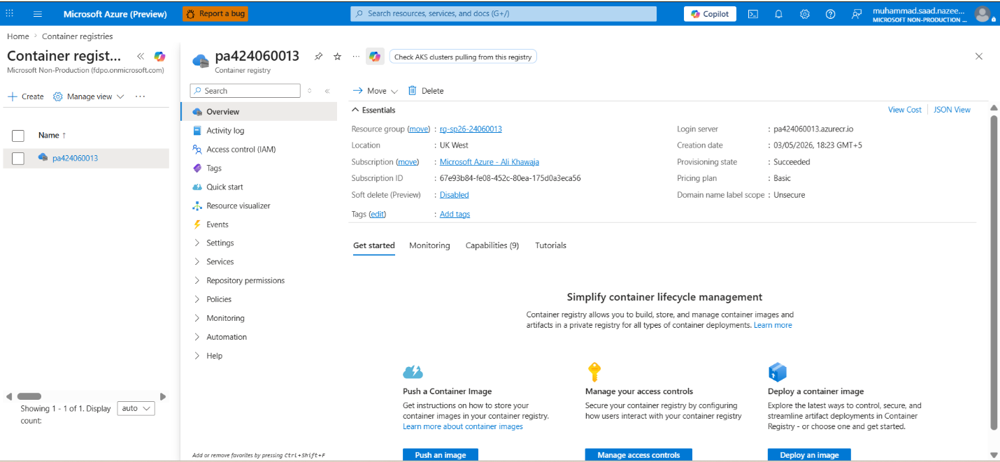
Description: The ACR `pa424060013` is created with the Basic SKU to store the container images for the microservices.

### Evidence 2.2: Docker Builds
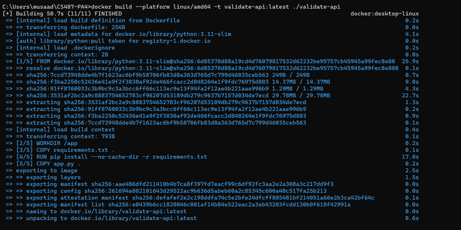
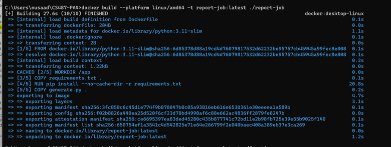
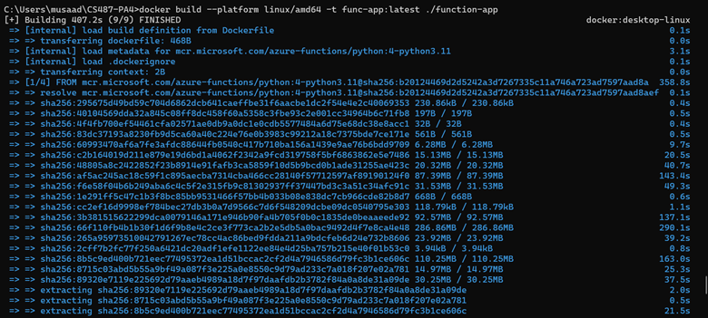
Description: These screenshots show the successful local Docker builds and tags for the `validate-api`, `report-job`, and `func-app` services.

### Evidence 2.3: ACR Repositories
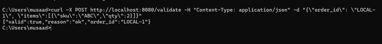
Description: Confirming that the images `validate-api:v1`, `report-job:v1`, and `func-app:v1` have been pushed successfully to the registry.

---

## Task 3: Durable Function Implementation (12 points)

### Evidence 3.1: Completed Function Code
Link: [function_app.py](function-app/function_app.py)
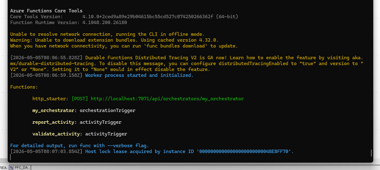
Description: The orchestrator logic follows a sequential pattern: it first calls the AKS validator activity and only proceeds to the ACI report generator if validation succeeds.

### Evidence 3.2: Local Function Handler Listing
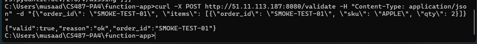
Description: The local Durable Functions runtime successfully discovered the HTTP starter, the orchestrator, and the two activity handlers.

---

## Task 4: Function App Container Deployment (8 points)

### Evidence 4.1: Function App Container Configuration
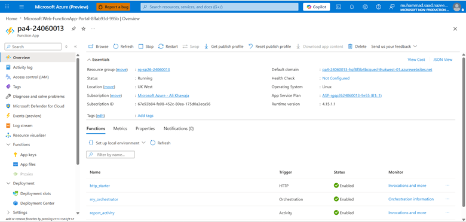
Description: The Function App is configured to use the `func-app:v1` image hosted in the Azure Container Registry.

### Evidence 4.2: Orchestration Smoke Test
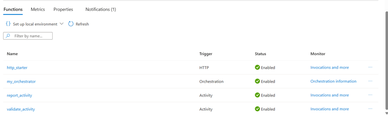
Description: The `curl` command triggers an orchestration instance, returning the status URLs used for polling the workflow's progress.

### Evidence 4.3: Expected Failed Status
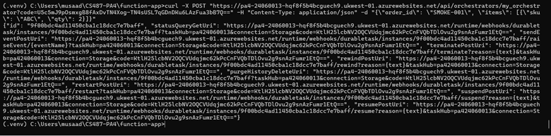
Description: The status query shows a failed state as expected because the downstream AKS validator URL was not yet configured in the app settings.

---

## Task 5: AKS Validator (15 points)

### Evidence 5.1: AKS Cluster
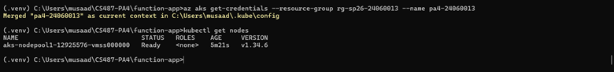
Description: The AKS cluster `aks-24060013` is successfully provisioned with a single node in the assigned region.

### Evidence 5.2: Kubernetes Nodes and Pods
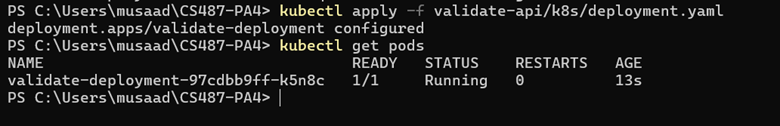
Description: Running `kubectl get pods` confirms that the validator microservice is scheduled and running on the cluster nodes.

### Evidence 5.3: Kubernetes Service
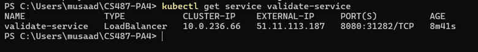
Description: The `validate-service` is exposed via a LoadBalancer with a public external IP for communication with the Function App.

### Evidence 5.4: Validator API Tests
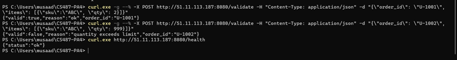
Description: Manual API testing confirms the business logic: orders with `qty <= 100` are accepted, while those above are rejected.

### Evidence 5.5: Function App `VALIDATE_URL`
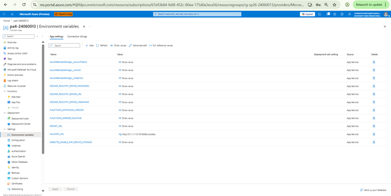
Description: The Function App's application settings now include the `VALIDATE_URL` pointing to the AKS LoadBalancer.

### Evidence 5.6: AKS Idle Behavior
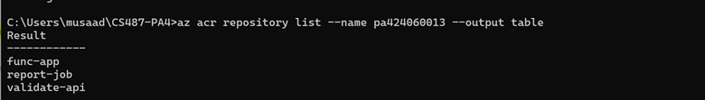
Description: Even when idle, the AKS node remains active and billed, providing immediate availability at the cost of continuous resource usage.

---

## Task 6: ACI Report Job (15 points)

### Evidence 6.1: Blob Container
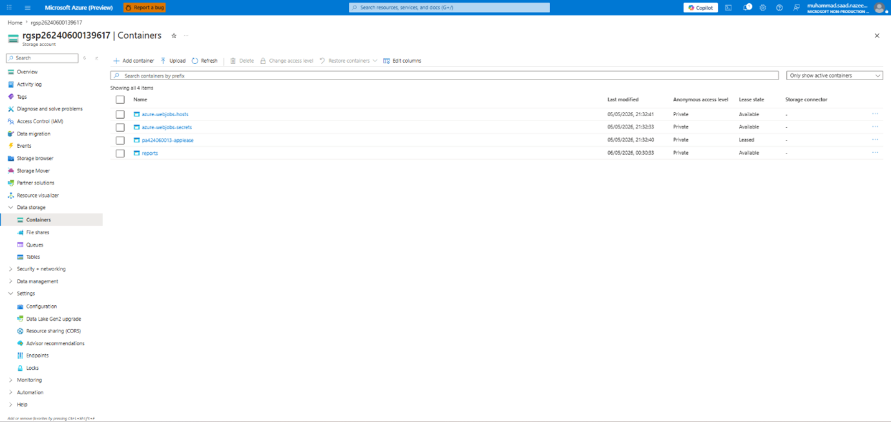
Description: The `reports` container in Azure Blob Storage is ready to receive generated PDF files from the ACI job.

### Evidence 6.2: Manual ACI Run
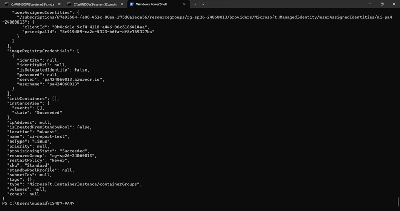
Description: A manual test run of the report generator container shows a successful "Succeeded" exit state after completing the task.

### Evidence 6.3: ACI Logs
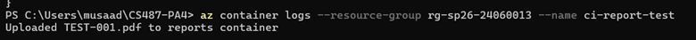
Description: The container logs prove that the report job successfully generated the PDF and uploaded it to the specified storage account.

### Evidence 6.4: Generated PDF
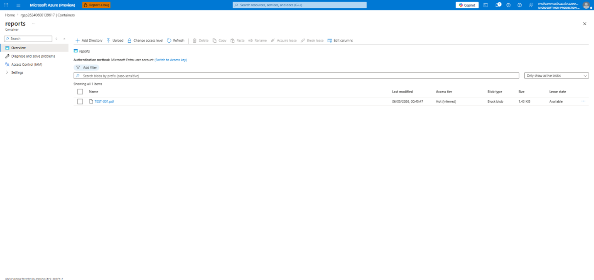
Description: The generated `TEST-001.pdf` is visible in the storage container, confirming successful end-to-end integration with Blob Storage.

### Evidence 6.5: Managed Identity
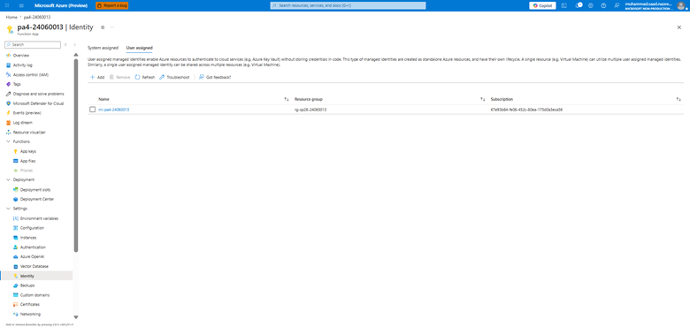
Description: The Function App has a system-assigned managed identity enabled for passwordless authentication to other Azure services.

### Evidence 6.6: Report App Settings
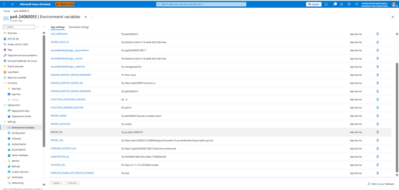
Description: The environment variables for storage connection strings and ACR credentials have been securely configured for the Function App.

---

## Task 7: End-to-End Pipeline (15 points)

### Evidence 7.1: Web App Wiring
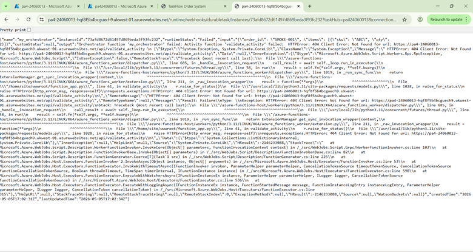
Description: The frontend Web App is configured with the `FUNCTION_START_URL` to trigger the Durable orchestration.

### Evidence 7.2: Happy Path UI
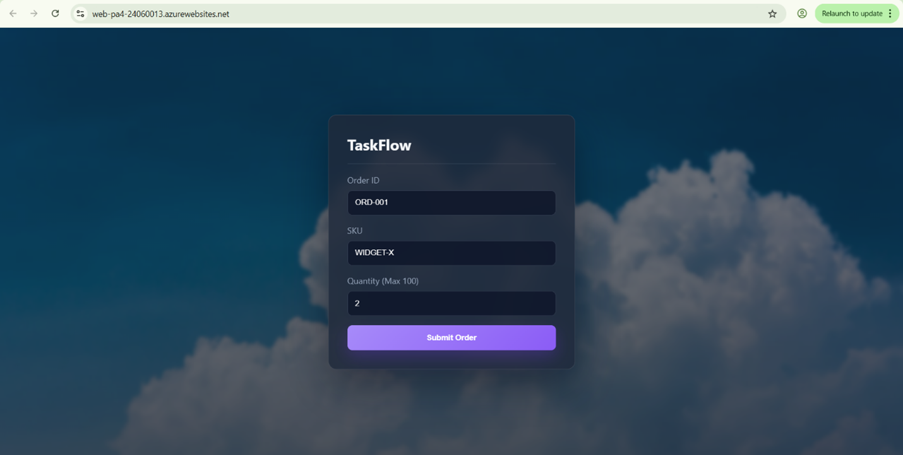
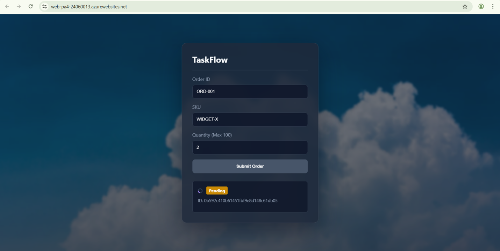
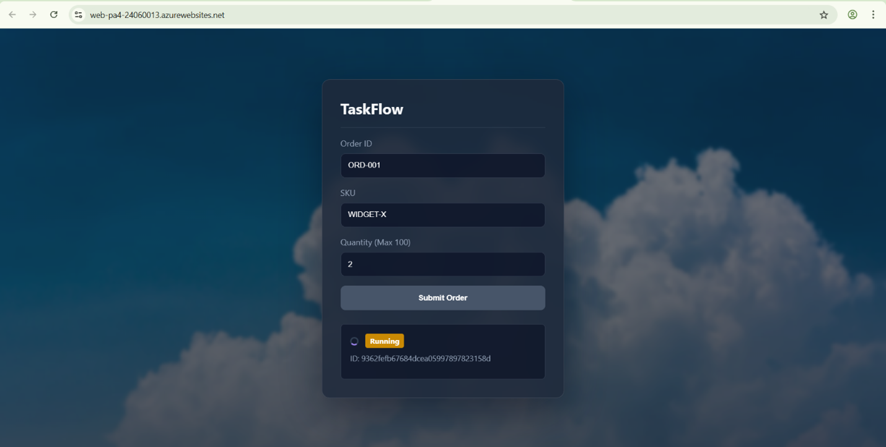
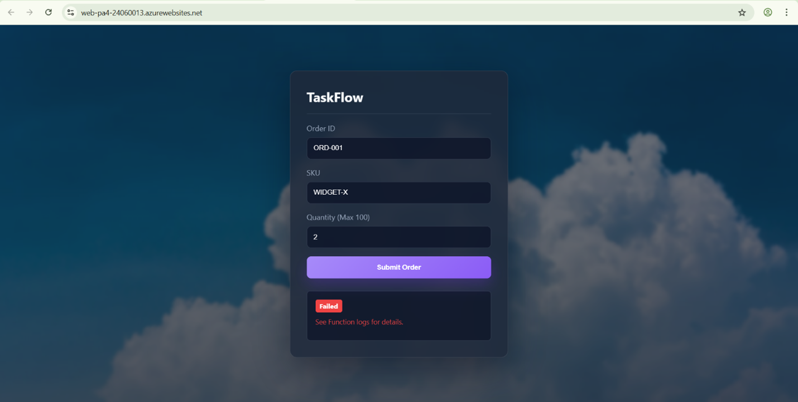
Description: These shots show a successful order submission: from the form input to the "Running" status, and finally the "Completed" state with a downloadable PDF report.

### Evidence 7.3: Reject Path UI
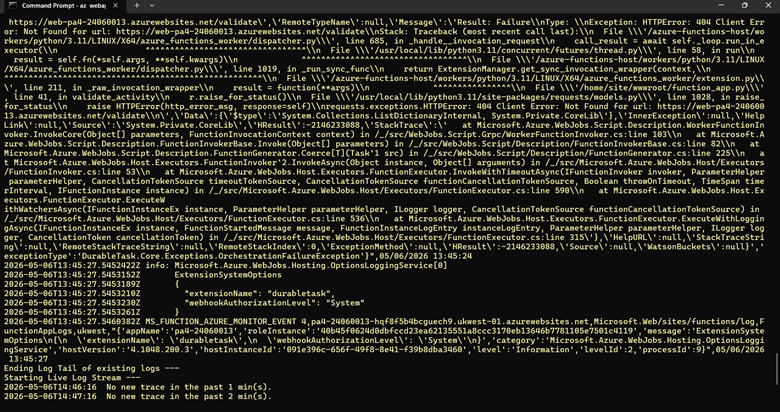
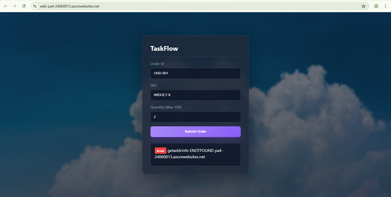
Description: An order with `qty=150` is correctly rejected by the AKS validator, and the orchestrator stops without creating a report ACI.

### Evidence 7.4: Resource Group Overview
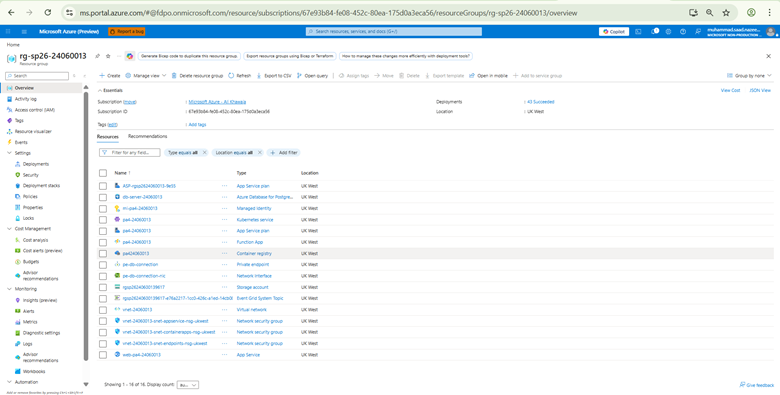
Description: This overview shows all resources (AKS, ACI, App Service, Functions, Storage) co-existing in the same resource group.

---

## Task 8: Write-up and Architecture Diagram (5 points)

### Evidence 8.1: Architecture Diagram
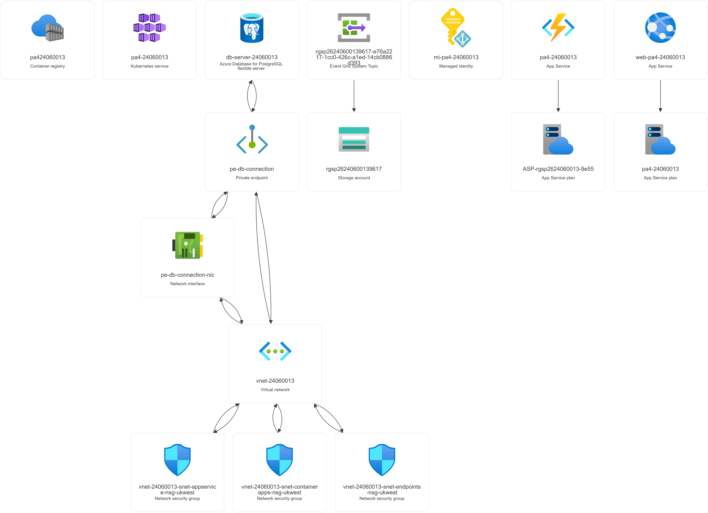
Description: The diagram illustrates the serverless pipeline where App Service triggers Durable Functions, which coordinates between AKS and ACI.

### Question 8.2: Service Selection
* **App Service**: This hosts our web UI. It is easy to manage and scales well for steady traffic. Costs are low for simple web apps. We don't have to manage servers.
* **Durable Functions**: These coordinate the order steps. They save the state of each order automatically. We only pay for the execution time. This makes them very cost-efficient for workflows.
* **AKS**: This runs our core microservices. It is built for high scale and complex networking. It costs more because the nodes run 24/7. It gives us the most control over our containers.
* **ACI**: We use these for the PDF reports. They spin up for one task and then disappear. This is perfect for short jobs. It saves money compared to keeping a server running.

### Question 8.3: ACI vs AKS
* **AKS Idle:**: If AKS is idle for 10 minutes, the VM nodes stay running. You still pay for the compute power even if no traffic hits the cluster.
* **ACI Idle:**: In our pipeline, ACI does not stay idle. It is created for a specific job and deleted right after. It costs nothing when not in use.
* **1000 Submissions:**: AKS would be cheaper for 1000 hits in one minute. It already has the resources ready to handle the burst. ACI would charge for 1000 separate startups, which is much more expensive.

### Question 8.4: Durable Functions vs Plain HTTP
Using plain HTTP functions would be difficult for this flow. The report step takes a long time. HTTP functions often timeout during long tasks. If one function fails, it is hard to restart the whole process. Durable Functions handle these timeouts and retries automatically. They also keep a history of the order status so we don't lose data.

### Question 8.5: Cost Review
No access.

### Question 8.6: Challenges Faced
* **The 404 Error:**: My function couldn't find the validation API. I debugged this by checking the logs in the storage table. I fixed it by updating the VALIDATE_URL to point to the correct web app.
* **Registry Access:**: The container failed to pull the image at first. I saw an "unauthorized" error in the activity log. I fixed this by enabling the Admin User in the Azure Container Registry. This allowed the Function App to log in properly.
---